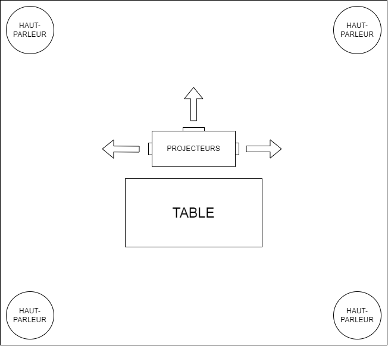

# 🔥🔥🔥✨✨ Projet de table réactive ✨✨🔥🔥🔥

## Concept
il y aurais une table en pleins milieux de l'espace réserver a notre porjet qui lorsque les invité intéragisse avec la table en question projeterais des images sur les murs présent autours de l'oeuvre en même temps de jouer des sons.

Personne nécessaire pour faire fonctionner l'oeuvre : 1

### Conception
#### matériel
- 4 haut-parleur (ou plus, c'est jay qui s'en occupe 😎👍)
- 3 projecteur
- table rectangulaire

Les trois projecteurs seraient accroché au plafond  

### Problèmes

problèmes avec les projecteurs #1 : si il n'y a pas trois murs autours de la table on ne peut pas.

problèmes avec les projecteurs #2 : si il y a rien pour attacher les projecteur au plafonds y faudrais potentiellement acrocher le projecteur a la table et je trouve que ça brise un coté cool de l'interaction qui est de se prommener autours de la table.

Problème avec le projet en general : le projet est dificilement réalisable à l'exterieur.

### Création table

Une table de billard serais idéal pour la réalisation de la table étant donner qu'il y a un creu a l'intérieur qui pourrais nous permettre de placer une caméra pour la détection de l'objet a partire d'une image. Une plaque de plastique acrylique pourrais séparer l'objet de détection et le creu de table de billare où il y aurrais la caméra. Si on a besoins de connecter des composantes électronique à notre table, on peut toujours mettre des planches panneau de bois sur les coté pour cacher le dessous de la table ou mettre un genre de nappe sur les coté.

### Détection d'image
L'idée de détection d'image est expliquer par [Jacob](https://externalsip.github.io/rechercheProjetFinalRepo)

### Projection

#### Applications 
- OBS studio
- Mad Mapper

