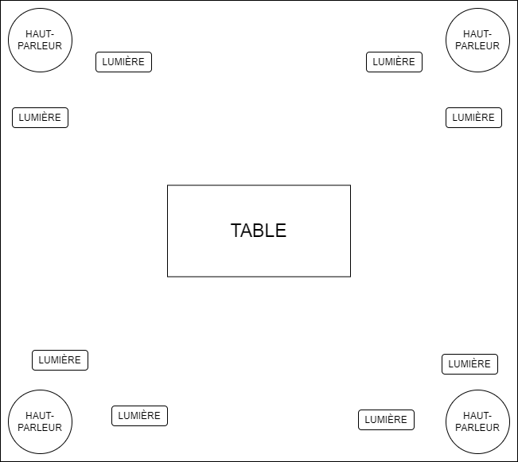
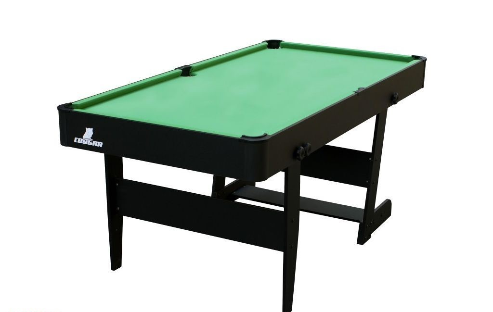

# 🔥🔥🔥✨✨ Projet de table réactive ✨✨🔥🔥🔥
## idée Général

Les gens qui viennent experimenter l'installation sont invité a venir placer et bouger des objects de détection prédéfinis sur une table rectengulaire qui va ensuite activé des sons (mélodis/beat) pour crée un genre de musique de style drone autours d'eux. dépendamment quelle object de détection est utiliser, un son diférent sera généré et dépendamment si l'utilisateur place l'object haut ou bas sur la table, le son sera plus aigus ou plus grave. De plus, il y aurais des projections sur les murs en liens avec l'intensité du sons de la musique.

### inspirations
- [Incredibox](https://www.incredibox.com/fr/) : [video exemple](https://www.youtube.com/watch?v=kjOJ1a_HrZs)
- [My Singing Monsters](https://www.bigbluebubble.com/home/games/my-singing-monsters-series/my-singing-monsters/) : [video exemple](https://www.youtube.com/watch?v=KqreWm5ZpHw)

## Conception
### matériel
- 4 haut-parleur (ou plus, c'est [Jérémy](https://jayiscooler.github.io/Projet_table_interactive/#/) qui s'en occupe 😎👍)
- table rectangulaire
- Personne nécessaire pour faire fonctionner l'oeuvre : 1

### Problèmes

Le problème est dificilement réalisable à l'exterieur à cause de la table et de la température imprévisible.

Problème avec le projet en general : le projet est dificilement réalisable à l'exterieur.

### Création table

Une table de billard serais idéal pour la réalisation de la table étant donner qu'il y a un creu a l'intérieur qui pourrais nous permettre de placer une caméra pour la détection de l'objet a partire d'une image. Une plaque de plastique acrylique pourrais séparer l'objet de détection et le creu de table de billare où il y aurrais la caméra. Si on a besoins de connecter des composantes électronique à notre table, on peut toujours mettre des planches panneau de bois sur les coté pour cacher le dessous de la table ou mettre un genre de nappe sur les coté.

### Détection d'image
L'idée de détection d'image est expliqué par [Jacob](https://externalsip.github.io/rechercheProjetFinalRepo)

Il faudrais trouver une façon de pouvoir détecter la position de l'objet sur la table réactive pour pouvoir permettre la possibilité de faire les sons plus aigus ou plus grave.

